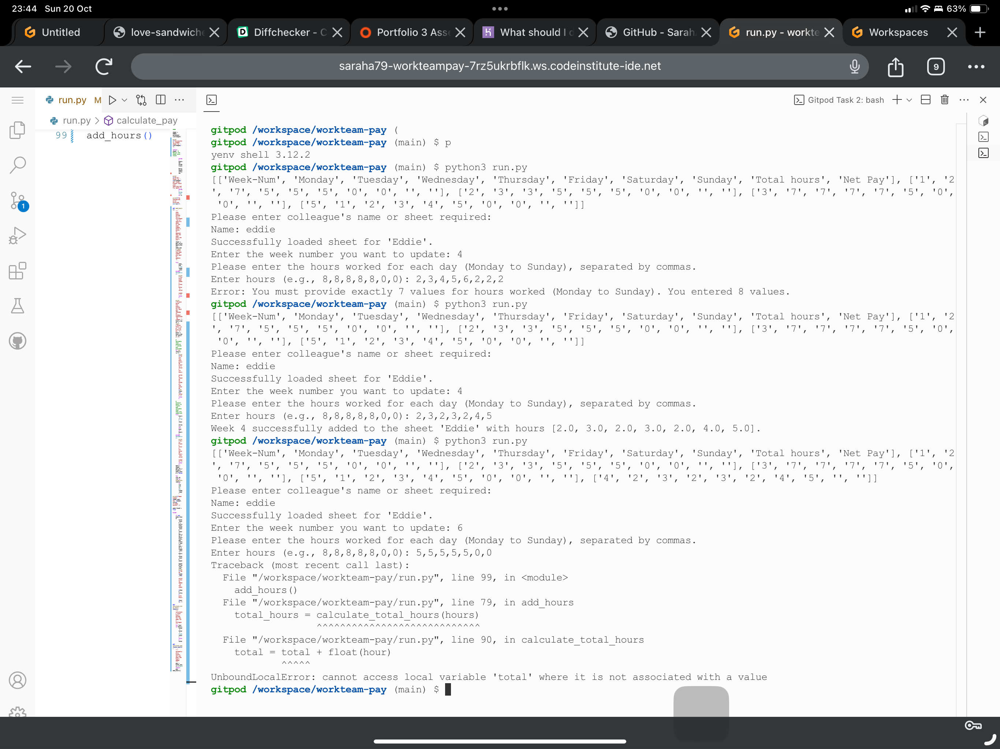
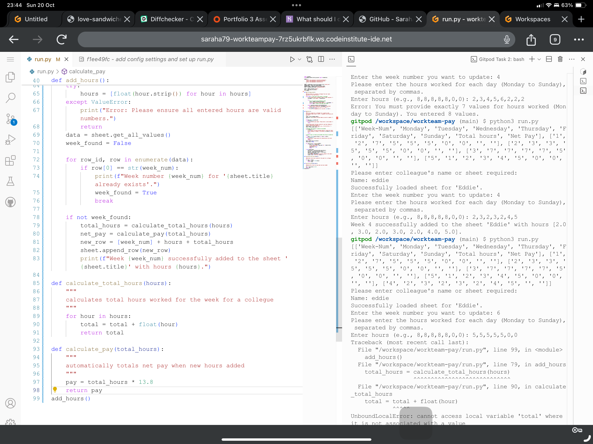
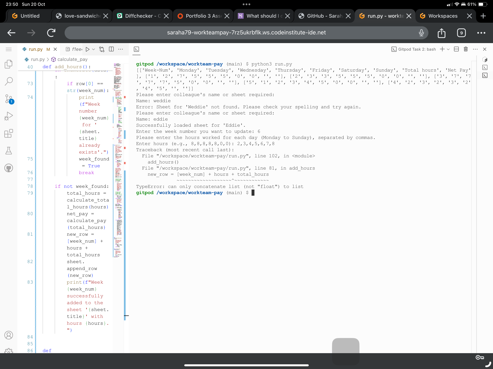
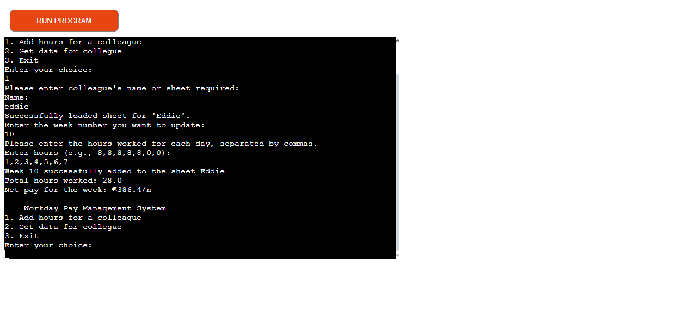
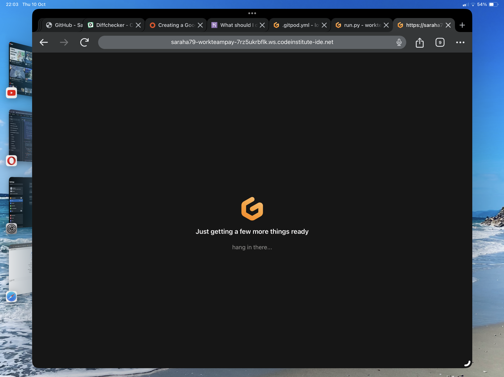
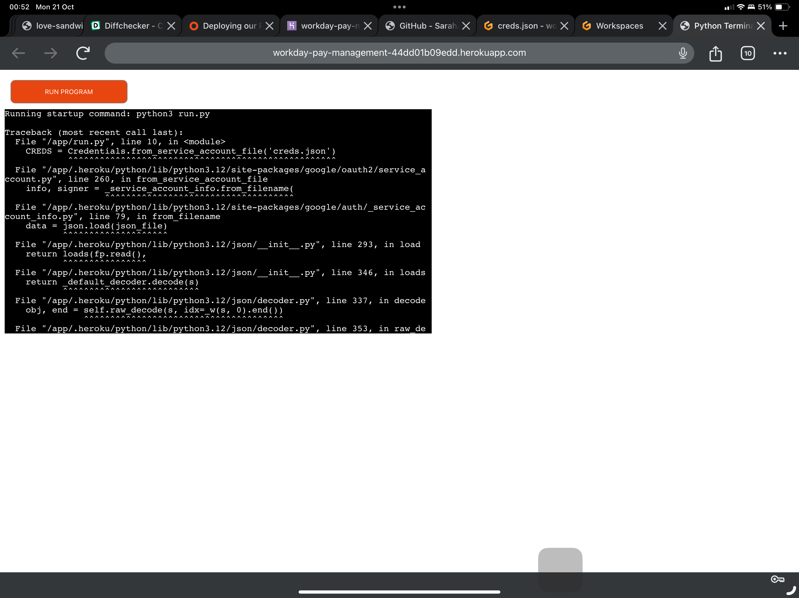
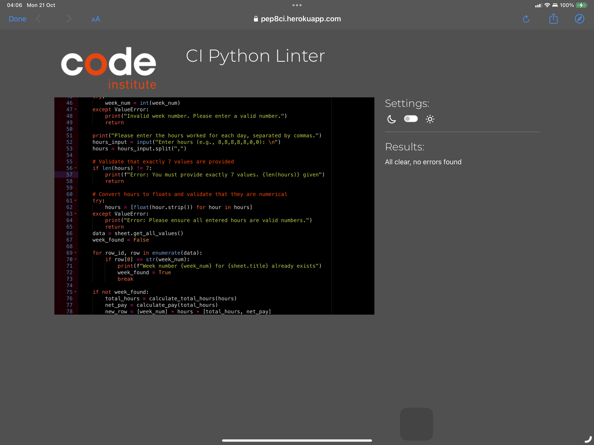
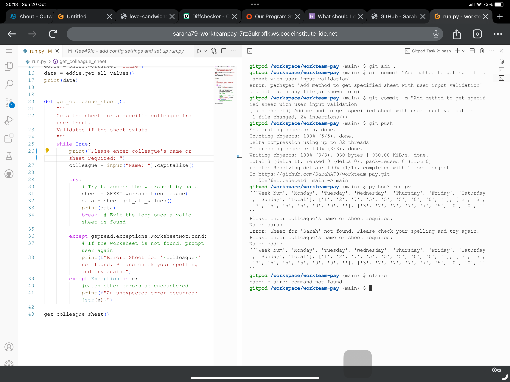
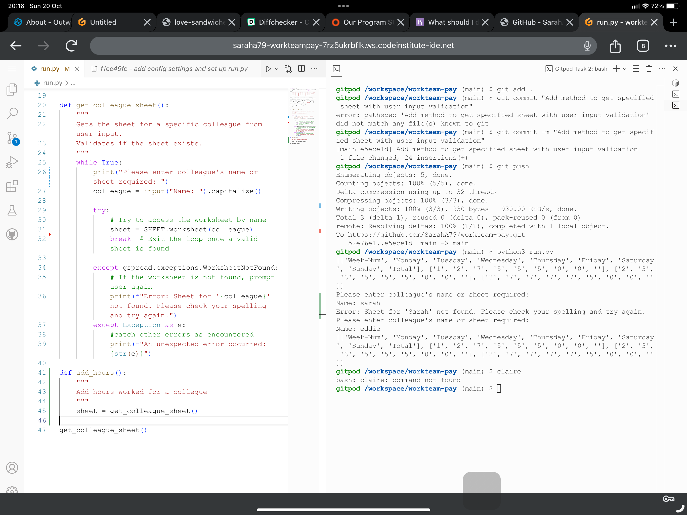
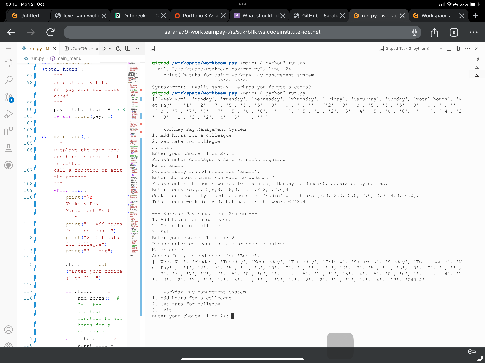

# Welcome to the Workday Pay Management System,

This project has been created with the intention of making it easy for a user to log and retrieve a collegues working hours and net pay before deductions to aid in ensuring that a worker is getting the correct hours paid each week.

## Why create this project?

for a long while ther e has been disputes in my workplace where collegues are missing hours and have reaquested that our supervisor chech the number of hours worked and net pay before deductions to ensure that collegues have been paid correctly and until now she has had to do that manually by use of a calculator. 
i craeted this app to make it easy for her to simply enter in the hours worked for each week and retrieve the totals for a specific collegue

### Main requirements

- Must ensure that a collegues data sheet exits before moving ahead with any data retrieval or additions/calculations
- User must be able to create new week data for a specific collegue without overwriting existing data
- User must be able to retrieve data for each collegue 
- system must automatically calculate totals from enetred hours 
- system must store the data netered into a secured google worksheet
- system must validate data before adding it to the worksheets to ensure file does not get corrupted

### Tests peerformed
1. Check collegue sheet exists 
  - incorect name
  - lowercase name
  - correct collegue name
  - no collegue of that name
  All checks passed with data varified and correct sheet only loading when collegues name is entered either as lower case or capitalized and spelled correctly. Prompt is given where data entered is invalid with oauth message as appropriate

2. Week number for adding data correct so as to not duplicate or write over an existing entry
  - no week number exists, creates new line of data on sheet when entered into system
  - week number already exists, warning given that week number already exists, no data overwritten
  - week number not a valid number - prompt given that user needs to provide a number 

3. Hours worked
  - correct number of days to add, 
  - numbers valid as floats

4. data returned f is valid
5. data added to sheets properly with calculations for hours worked and pay due performed correctly with results printed back on completion of the method call
when each method completes menu is reloaded until user selects to quit the program

# Project Images

## Bug Images

### Bug 1

### Bug 2

### Bug 3

### Bug 4

## Other Images

### Gitpod Internet Problem

### Gitpod Internet 2

### Heroku Bug 1

### PEP8 Validation

### Testing 1

### Testing 2

### Testing 3

### Future development
- Add new sheets for new collegues
 - remove sheets for old collegues
 - add collegues totals to the overall total sheet
 - add in dates to replace week numbers with data validation
 - update weeks where input error created incorrectly ie. wrong number of hours put in
 - validation for maximum nuber of hours worked in a given day
 - user confirmation method for use with sheet deletion, addtion of new sheets, updating previous entries

### Problems faced
Login for Heroku locked me out of account for MFA security usb key not owned.
Imposter Syndrome kicked my butt on this one creating a huge mental block. 
deployment to heroku initially didnt work as there was a missing closed curly bracket at the end of the creds var, 
Initially wrote methods for getting data, getting users sheet, getting a specific weeks details on a specified sheet but it was disjointed and they werent working as i had wanted so spent too long trying to work on them and fix them but ended up deleting them to re-write the whole program. 

### Heroku Deployment

This project uses [Heroku](https://www.heroku.com), a platform as a service (PaaS) that enables developers to build, run, and operate applications entirely in the cloud.

Deployment steps are as follows, after account setup:

- Select **New** in the top-right corner of your Heroku Dashboard, and select **Create new app** from the dropdown menu.
- Your app name must be unique, and then choose a region closest to you (EU or USA), and finally, select **Create App**.
- From the new app **Settings**, click **Reveal Config Vars**, and set the value of KEY to `PORT`, and the value to `8000` then select *add*.
- If using any confidential credentials, such as CREDS.JSON, then these should be pasted in the Config Variables as well.
- Further down, to support dependencies, select **Add Buildpack**.
- The order of the buildpacks is important, select `Python` first, then `Node.js` second. (if they are not in this order, you can drag them to rearrange them)

Heroku needs two additional files in order to deploy properly.
- requirements.txt
- Procfile

You can install this project's **requirements** (where applicable) using:
- `pip3 install -r requirements.txt`

If you have your own packages that have been installed, then the requirements file needs updated using:
- `pip3 freeze --local > requirements.txt`

For Heroku deployment, follow these steps to connect your own GitHub repository to the newly created app:

Either:
- Select **Automatic Deployment** from the Heroku app.

Or:
- In the Terminal/CLI, connect to Heroku using this command: `heroku login -i`
- Set the remote for Heroku: `heroku git:remote -a app_name` (replace *app_name* with your app name)
- After performing the standard Git `add`, `commit`, and `push` to GitHub, you can now type:
    - `git push heroku main`

The frontend terminal should now be connected and deployed to Heroku!

### Local Deployment

This project can be cloned or forked in order to make a local copy on your own system.

For either method, you will need to install any applicable packages found within the *requirements.txt* file.
- `pip3 install -r requirements.txt`.

If you are using any confidential credentials, such as `CREDS.json` or `env.py` data, they will need to be manually added to your own newly created project as well.

#### Cloning

You can clone the repository by following these steps:

1. Go to the [GitHub repository]((https://github.com/sarahA79/workteampay)) 
2. Locate the Code button above the list of files and click it 
3. Select if you prefer to clone using HTTPS, SSH, or GitHub CLI and click the copy button to copy the URL to your clipboard
4. Open Git Bash or Terminal
5. Change the current working directory to the one where you want the cloned directory
6. In your IDE Terminal, type the following command to clone my repository:
    - `git clone (https://github.com/sarahA79/workteampay)`
7. Press Enter to create your local clone.

Alternatively, if using Gitpod, you can click below to create your own workspace using this repository.

Please note that in order to directly open the project in Gitpod, you need to have the browser extension installed.
A tutorial on how to do that can be found [here](https://www.gitpod.io/docs/configure/user-settings/browser-extension).

#### Forking

By forking the GitHub Repository, you can make a copy of the original repository on your own GitHub account to view and/or make changes without affecting the original owner's repository.
You can fork this repository by using the following steps:

1. Log in to GitHub and locate the [GitHub Repository](https://github.com/sarahA79/workteampay)
2. At the top of the Repository (not top of page) just above the "Settings" Button on the menu, locate the "Fork" Button.
3. Once clicked, you should now have a copy of the original repository in your own GitHub account!

### Credits
Huge thanks goes to my project mento Dick Vlanderren for being ads helpful as possible, and as patient as a saint.
massive thanks goes to my supervisor at work for allowing me to plug away at this in extended breaks at work due to internet issues at home,
Apologies and gratefuleness beyond words to my beautiful son who has had to endure an extended period of time going without his mummy and son playtimes graciously and beyond his years in understanding.
Kera Cudmore of code Insitute for her readme guides and Lewis lwetb-b tutor for his guidance and encouragement

Initial idea created from the love sandwiches model and adapted to make my own (hopefully) unique project.
